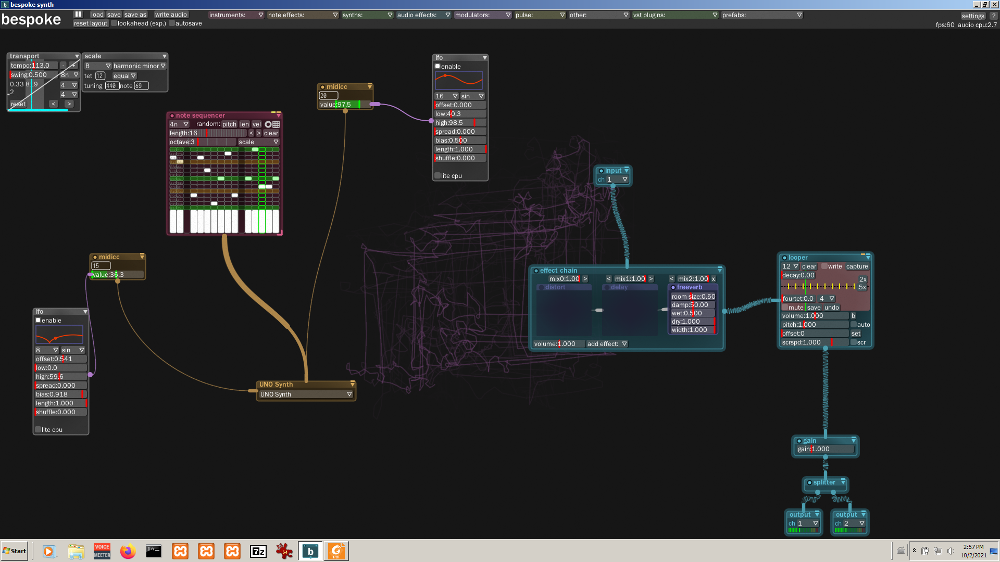

# using external gear
 

you need

- some of the `instruments` (e.g. `notesequencer`) to output MIDI messages
- (optional) `midicc` module to send some CC's
- `midioutput` module to route your MIDI message to external gear (it renames itself after name of your synth)
- `input` module to bring external audio back to your computer
-  (optional) `effectchain` to process your audio in Bespoke or `looper` or whatever

See it in action:

How it looks in real world:

